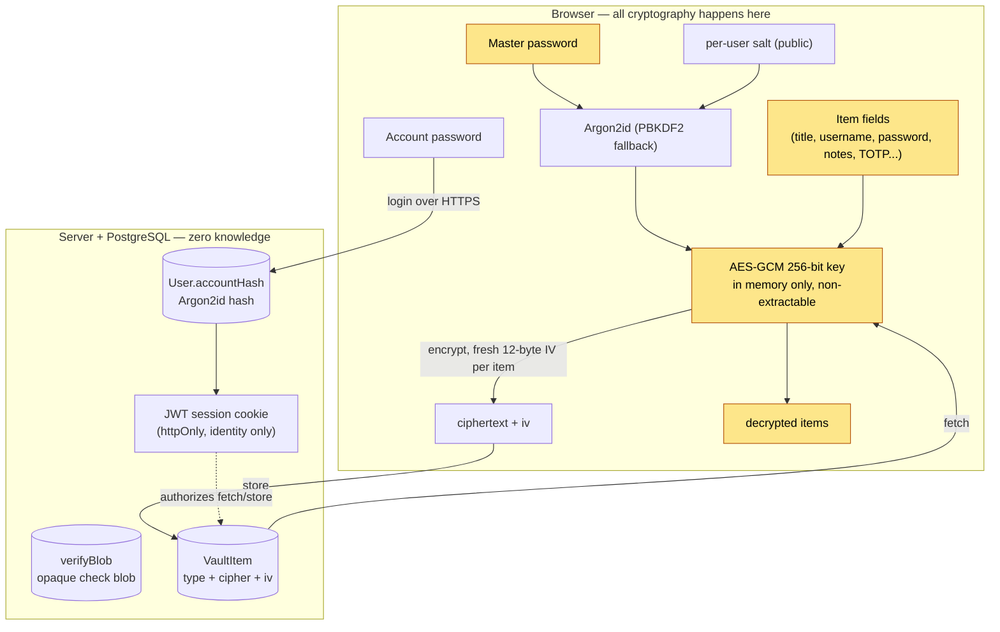

# Vaulty

A **zero-knowledge password manager**. All encryption and decryption happen in
your browser; the server only ever stores opaque encrypted blobs. Even a full
database leak reveals nothing usable.

> Portfolio flagship demonstrating applied cryptography + secure full-stack
> engineering. See [PRD.md](PRD.md) for the full product spec.

- **Live demo:** _add your deployed URL here_
- **Stack:** Next.js 16 (App Router) - TypeScript - Web Crypto - Prisma - PostgreSQL

---

## The idea in one sentence

I use **AES-GCM** (Web Crypto) with an **Argon2id**-derived key and a
zero-knowledge architecture, so the server never sees plaintext, the master
password, or the encryption key.

## Two passwords, two jobs

| | Account password | Master password |
| --- | --- | --- |
| Purpose | Sign in (prove identity) | Encrypt/decrypt the vault |
| Leaves the browser? | Yes (over HTTPS) | **Never** |
| Server stores | An Argon2id **hash** | Nothing derived from it |
| Can it decrypt data? | No | Yes (only in your browser) |

## Architecture



**What the server can see:** your email, an Argon2id hash of your account
password, a per-user salt, opaque ciphertext/IVs, and a check blob it cannot
decrypt. **What it can never see:** your master password, the derived key, or
any plaintext item field (including titles).

The master password's correctness is verified **client-side** by decrypting the
stored check blob - never by sending anything to the server.

## Features

**Vault** - Login and Secure Note items, full client-side encryption (every
field, including the title), reveal/copy, open URL, search over decrypted
titles/usernames, password **strength meter** (zxcvbn).

**Security** - Argon2id key derivation, in-memory non-extractable key, manual
**Lock**, **auto-lock** on inactivity and on tab close/refresh, **clipboard
auto-clear**, strong **password generator** (unbiased CSPRNG).

**Wow features**

- **Breach check** via HaveIBeenPwned k-anonymity (only a SHA-1 prefix leaves
  the browser).
- **TOTP 2FA** codes (RFC 6238) with a live code + countdown; secret stored
  encrypted in the item.
- **One-time share links** - the decryption key lives in the URL fragment and
  never reaches the server; the ciphertext self-destructs on first open.

## Tech stack

Next.js 16 (App Router) - TypeScript - React 19 - Tailwind v4 + shadcn/ui -
Web Crypto API + `hash-wasm` (Argon2id) + `@zxcvbn-ts` - Prisma + PostgreSQL -
`jose` (JWT) - Vitest + Playwright - Vercel + Neon + GitHub Actions.

## Getting started

Prerequisites: Node 22 (see `.nvmrc`) and Docker.

```bash
nvm use                 # Node 22
npm install
cp env.example .env     # set DATABASE_URL and a JWT_SECRET (>=16 chars)
docker compose up -d    # local Postgres
npm run db:migrate      # create tables
npm run dev             # http://localhost:3000
```

## Testing

```bash
npm test        # Vitest unit tests (crypto round-trips, TOTP RFC vectors, etc.)
npm run e2e      # Playwright end-to-end (needs Postgres running)
```

The crypto module is covered by round-trip, wrong-key, and tamper tests; TOTP is
checked against the RFC 6238 vectors; E2E covers signup -> onboard -> lock ->
unlock, encrypted item CRUD, and the one-time share flow.

## Deployment (Vercel + Neon)

1. **Database:** create a [Neon](https://neon.tech) project and copy the pooled
   connection string.
2. **Migrate:** with `DATABASE_URL` set to Neon, run `npm run db:deploy`
   (`prisma migrate deploy`).
3. **Vercel:** import the repo. Set env vars `DATABASE_URL` and `JWT_SECRET`
   (generate one with `openssl rand -base64 48`). Vercel auto-detects Next.js;
   `postinstall` runs `prisma generate`. Deploy.

Serve over HTTPS only; the session cookie is `Secure` in production.

## Scripts

| Script | Purpose |
| --- | --- |
| `dev` / `build` / `start` | Next dev / production build / serve |
| `lint` / `typecheck` | ESLint / TypeScript |
| `test` / `test:watch` | Vitest |
| `e2e` | Playwright |
| `db:migrate` / `db:deploy` / `db:studio` | Prisma migrate (dev) / deploy / studio |

## Notes

- **Stateless logout** clears the session cookie, but the JWT stays valid until
  its expiry (12h default). Fine for this scope; a revocation store or short
  TTL + refresh would harden it further.
- Prisma is pinned to 6.x (Prisma 7 dropped the classic `datasource.url`).
  `npm audit` reports 3 highs from `deepmerge-ts`, a transitive dep of the
  Prisma **CLI** (build-time only); `@prisma/client` ships with zero runtime
  deps, so nothing vulnerable reaches production.
